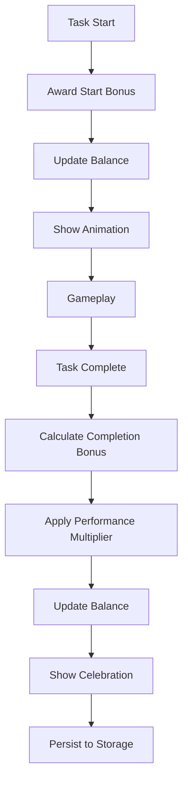

# Zen Points Persistence System Design

## Overview

This design implements a comprehensive zen points persistence system that transforms zen points into a true persistent currency. The system provides task start bonuses, performance-based completion rewards, enhanced visual feedback, and seamless integration with both campaign and single task modes.

## Architecture

### Core Components

1. **Zen Points Manager** - Central service for all zen point operations
2. **Bonus Calculator** - Handles task start and completion bonus calculations
3. **Visual Effects System** - Manages animations and celebratory feedback
4. **Persistence Layer** - Handles saving/loading zen point balances
5. **Balance Validator** - Ensures data integrity and error recovery

### Data Flow



## Components and Interfaces

### Zen Points Manager

**Location:** `assets/js/zen-points-manager.js`

```javascript
export class ZenPointsManager {
    // Core balance management
    static getCurrentBalance()
    static addPoints(amount, type, showAnimation = true)
    static spendPoints(amount, showAnimation = true)
    static setBalance(amount)
    
    // Bonus calculations
    static calculateTaskStartBonus(taskId, difficulty = 1.0)
    static calculateCompletionBonus(finalStressLevel)
    static awardTaskStartBonus(taskId)
    static awardCompletionBonus(finalStressLevel)
    
    // Persistence
    static saveBalance()
    static loadBalance()
    static validateBalance()
}
```

### Visual Effects System

**Location:** Enhanced `assets/js/ui-manager.js`

```javascript
// New functions to add
export function showZenPointAnimation(amount, type, position)
export function showCompletionCelebration(totalBonus, breakdown)
export function animateZenPointCounter(oldValue, newValue)
export function createZenPointParticles(element, count)
```

### Bonus Calculator

**Location:** `assets/js/bonus-calculator.js`

```javascript
export class BonusCalculator {
    static TASK_START_BASE = 100
    static COMPLETION_BASE = 1000
    static MAX_PERFORMANCE_MULTIPLIER = 2.0
    
    static calculateTaskStartBonus(difficulty)
    static calculatePerformanceMultiplier(stressLevel)
    static calculateCompletionBonus(stressLevel)
}
```

## Data Models

### Zen Point Transaction

```javascript
{
    amount: number,
    type: 'start_bonus' | 'completion_bonus' | 'round_win' | 'zen_activity' | 'shop_purchase',
    timestamp: number,
    metadata: {
        taskId?: string,
        stressLevel?: number,
        multiplier?: number
    }
}
```

### Enhanced Campaign State

```javascript
campaignState = {
    // Existing properties...
    zenPointBalance: number,
    zenPointTransactions: ZenPointTransaction[],
    totalZenEarned: number, // Keep for statistics
    lastBalanceUpdate: number
}
```

## Error Handling

### Balance Validation

1. **Negative Balance Detection**: Automatically correct to 0 with user notification
2. **Overflow Protection**: Cap at 999,999 zen points maximum
3. **Corruption Recovery**: Validate structure and repair with defaults
4. **Storage Failures**: Graceful fallback to session-based points

### Transaction Logging

- Log all zen point changes for debugging
- Maintain transaction history for recovery
- Validate transaction integrity on load

## Testing Strategy

### Unit Tests

- Bonus calculation accuracy
- Balance persistence and recovery
- Visual effect triggering
- Error handling scenarios

### Integration Tests

- Campaign mode zen point flow
- Single task mode isolation
- Shop integration with new balance system
- Cross-task zen point persistence

### User Experience Tests

- Visual feedback clarity and timing
- Performance impact of animations
- Balance display accuracy across all screens

## Performance Considerations

### Animation Optimization

- Use CSS transforms for smooth animations
- Batch DOM updates to prevent layout thrashing
- Implement animation queuing for multiple simultaneous effects

### Storage Efficiency

- Compress transaction history after 100 entries
- Use debounced saves to reduce localStorage writes
- Implement lazy loading for transaction history

### Memory Management

- Clean up animation elements after completion
- Limit particle effect counts based on device performance
- Use object pooling for frequently created elements

## Implementation Phases

### Phase 1: Core Persistence
- Implement ZenPointsManager
- Add balance persistence to campaign state
- Update task start/completion flows

### Phase 2: Bonus System
- Implement BonusCalculator
- Add task start bonuses
- Add performance-based completion bonuses

### Phase 3: Visual Effects
- Enhanced zen point animations
- Completion celebration system
- Particle effects for large bonuses

### Phase 4: Integration & Polish
- Campaign overview balance display
- Shop integration updates
- Error handling and validation

## Migration Strategy

### Existing Save Data

1. Detect legacy campaign saves without zen point balance
2. Initialize balance based on totalZenEarned and current game state
3. Preserve existing totalZenEarned for statistics
4. Add migration flag to prevent re-migration

### Backward Compatibility

- Maintain existing zen point display and spending functions
- Ensure shop system continues to work with new balance system
- Preserve existing stress system zen point costs